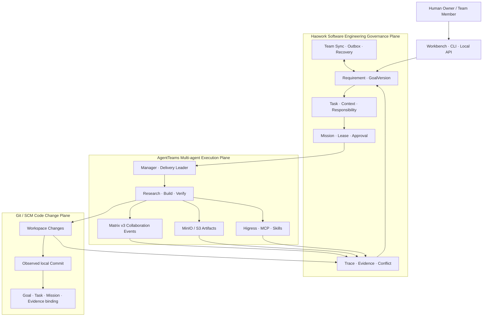
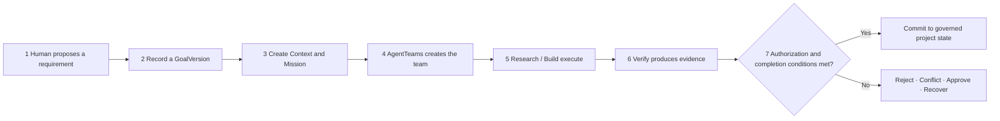

English version | [中文版](README_cn.md)

<h1 align="center">Haowork</h1>

<p align="center">
  <strong>Software engineering governance and traceability for AI-native development</strong><br>
  Let AgentTeams coordinate execution while goals, responsibility, evidence, and code changes remain traceable
</p>

<p align="center">
  
  
  
  
</p>

<p align="center">
  <a href="#-what-problem-does-haowork-solve">Problem</a> ·
  <a href="#-use-cases">Use Cases</a> ·
  <a href="#️-architecture">Architecture</a> ·
  <a href="#-how-haowork-and-agentteams-work-together">Responsibilities</a> ·
  <a href="#-online-read-only-demo">Online Demo</a> ·
  <a href="#-quick-start">Quick Start</a> ·
  <a href="#-verification-boundaries">Verification</a>
</p>

> **Project status: early preview.** The repository implements governance facts, Missions, risk approvals,
> execution traces, team synchronization, signed transfers, governed local Git Commit provenance, and an
> AgentTeams `v1.2.2` integration contract.
> A real dual-zone deployment still requires the complete official image set, runtime credentials, model
> services, and Core Bridge. Missing dependencies produce explicit `BLOCKED_*` results rather than simulated success.

## 🎬 Online Read-only Demo

> [!NOTE]
> Visit [haowork.112318.xyz](https://haowork.112318.xyz/) to explore a **preloaded public case**.
> It shows how requirement chains, AgentTeams topology, approvals, traces, and cross-environment transfers relate.
> It is not connected to a real project, accepts no credentials, and exposes read-only server routes.

| What you want to inspect | Where to look in the demo |
| --- | --- |
| Whether AI Coding drifted from the original design | Review GoalVersion, requirement status, and ownership boundaries |
| How multiple Agents divide work | Inspect the bound Manager, Leader, Research, Build, and Verify topology |
| Why an output can be trusted | Inspect approval records, the Trace timeline, and independent verification summaries |
| How cross-zone transfer risk is controlled | Inspect Capsule allowlists, signature verification, approval, and rebinding steps |

The online demo is maintained independently. This repository does not contain its portal implementation,
server deployment configuration, or runtime credentials.

## 🧭 What Problem Does Haowork Solve?

AI Coding is moving software development from "people write code with tool assistance" to "people define goals
and constraints while Agents execute delivery." Higher implementation speed introduces a new set of engineering
problems:

- Can the latest conversation override the original requirements and architecture constraints?
- When several people direct several Agents, who proposed, approved, implemented, and verified each change?
- How does engineering context survive a device, model, Agent, or isolated-environment migration?
- When maintaining a legacy system, how can a team trace a code change back to its design rationale?

Traditional Git primarily records "user - Commit/Push - code change." Haowork adds a governance chain:

```text
Human -> explicit requirement and design -> responsibility and approval -> Agent execution evidence -> code change
```

Haowork does not replace Git or reimplement a multi-agent framework. It sits outside the Agent execution layer
and records requirements, design constraints, permissions, responsibility, evidence, and exception handling as
replayable engineering facts.

| Engineering question | Haowork's answer |
| --- | --- |
| Why should this change? | Requirement, GoalVersion, and Context |
| Who may change it? | Four-dimensional identity, Lease, Scope, and Approval |
| Who actually executed it? | Mission, AgentTeams topology, and RuntimeBinding |
| Can the result be trusted? | Trace, Evidence, Workspace Digest, and independent Verify |
| What happens when facts diverge? | Append-only history, explicit Conflict, human decisions, and Recovery |

## 🏭 Use Cases

### 1. Continuous Development Across Public and Isolated Environments

Teams in banking, securities, defense research, and other sensitive domains often operate in two environments.
The public zone offers stronger models, tools, and open-source ecosystems. The internal zone contains real business
data and supports long-term secondary development and maintenance. The zones cannot depend on continuous
connectivity, nor can they copy runtime identities, credentials, private conversations, or complete workspaces.

Haowork packages approved requirement versions, architecture constraints, responsibility, verification conclusions,
and minimal engineering facts into a signed Capsule. The importing side verifies, previews, approves, and checks
conflicts before rebinding logical responsibility to its local runtime. When an internal team encounters a difficult
problem, it can export only approved and allowlisted context for external analysis, then import the approved delta.

**Practical value:** design continuity survives environment, model, and Agent changes. Cross-zone transfer does not
require live connectivity and does not directly export the entire project or sensitive context.

### 2. Responsibility and Drift Governance for Small AI Coding Teams

In a team of 3 to 10 people, Agents may produce code much faster than humans can review every file. Team members
keep adding requirements, human memory decays, and Agents may optimize for the latest instruction while drifting
from the initial design. Issues, chats, and commits scatter the evidence, making it difficult to determine whether
the goal changed and who is responsible for the change.

Haowork maintains append-only Requirements, GoalVersions, Tasks, Contexts, Missions, Approvals, and Evidence.
Humans focus on goal changes, critical designs, risk approvals, and independent verification. Research, Build,
and Verify Agents operate only within explicit Leases and Scopes.

**Practical value:** a team can inspect direction, responsibility, and verification status without reading every
line of Agent output. Goal, design, or evidence divergence becomes an explicit conflict instead of silently
overwriting history.

### 3. Design-rationale Traceability for Legacy and Open-source Projects

When a team takes over a legacy system, the original developers may have left. When extending an open-source
project, maintainers usually see code and commits but may not know whether a restriction came from a business
requirement, architecture tradeoff, environment constraint, or temporary workaround.

For projects that use Haowork from the start, a code change can be traced back to its requirement version, context,
owner, Agent assignment, and verification evidence. For older projects without Haowork history, the system creates
a traceable baseline through "code and document import -> candidate relationships -> human confirmation." It does
not claim to reconstruct the original author's intent automatically.

**Practical value:** maintainers can distinguish recorded facts from later inference and evaluate refactoring
rationale, constraints, and impact with greater confidence.

## 🧩 Product Interfaces

Haowork currently exposes three interfaces backed by the same governance projection:

| Interface | Primary purpose |
| --- | --- |
| Workbench | Inspect goals, Missions, topology, approvals, traces, conflicts, and transfer previews |
| CLI | Initialize projects, issue Missions, synchronize team state, and perform governance operations |
| Local API / MCP | Expose authenticated, policy-constrained capabilities to browsers and Agent runtimes |

Inputs are human goals, design constraints, and approval decisions. Outputs are not chat summaries; they are
verifiable, replayable, and transferable engineering facts.

## 🏗️ Architecture



The first native SCM slice binds an explicitly selected, immutable local Git Commit to Goal, Task, Mission, and
projected Evidence. Push, Pull Request, webhook, and hosted-provider integrations remain future work and are not
presented as complete.

## 🔗 Governed Git Commit Provenance

Haowork does not create or push commits. A developer or delivery tool creates the commit through the normal Git
workflow, then explicitly asks Haowork to observe and bind its immutable object facts:

```text
local Git repository -> full Commit OID -> read-only object inspection
  -> proposed Goal / Task / Mission / Evidence relationship
  -> risk-based human approval -> confirmed binding
  -> reachability recheck -> superseded / invalidated when history diverges
```

- The event ledger stores object IDs, author/committer display names, email digests, message, and changed paths.
- It does not store raw email addresses, remote URLs, source code, patches, credentials, or private repository paths.
- L2/L3 confirmation requires a hash-bound approval; Build cannot self-confirm a high-risk relationship.
- A confirmed binding never completes a Task. Existing Evidence and completion gates remain authoritative.
- Force-moved or otherwise unreachable commits remain in append-only history and their bindings become invalid.

Use `haowork scm --help` or the Workbench **Git / SCM** panel. See
[`docs/scm-provenance.md`](docs/scm-provenance.md) for the exact policy and current boundaries.

## 🔄 How a Requirement Flows



Every step has an input, an accountable subject, and a failure exit. Agent output cannot declare itself complete.
A candidate result must satisfy authorization, artifact digest, independent verification, and required approvals.

## 🪪 Four-dimensional Identity Model for Teams

Haowork does not use one ambiguous `role` to represent user authority, Agent function, and runtime identity.
It separates four orthogonal dimensions:

| Dimension | Examples | Question answered |
| --- | --- | --- |
| SubjectKind | Human / Agent | What kind of subject performed the action? |
| GovernanceRole | Owner / Lead / Reviewer / Agent | Who may decide and approve? |
| AgentFunction | Manager / Leader / Research / Build / Verify | What delivery function does the Agent perform? |
| RuntimeBinding | Environment / Instance / Principal / Room / Revision | Which runtime currently executes the logical Agent? |

A RuntimeBinding change creates a new Revision while preserving earlier bindings. Build and Verify must be
performed by different logical Agents, and a requester cannot self-approve a high-risk request.

## 🤝 How Haowork and AgentTeams Work Together

| Layer | Haowork | AgentTeams v1.2.2 |
| --- | --- | --- |
| Decision and authorization | GoalVersion, Mission, Lease, Scope, Approval | Consumes an authorized Mission |
| Team organization | Defines roles, responsibility, and runtime bindings | Creates Manager, Worker, Team, and Human CRDs |
| Collaborative execution | Validates boundaries and receives results | Manager decomposes WorkItems and role Agents execute them |
| Messages and artifacts | Validates Mission, environment, digest, and ownership | Matrix carries events and MinIO/S3 stores artifacts |
| Tool invocation | Policy Runtime, MCP authentication, Skill audit | Higress provides Consumer and Route infrastructure |
| Completion decision | Verify, Evidence, approval, and conflict resolution | Does not alter the Goal or declare governance completion |

### How AgentTeams Roles Are Applied

| Role | Responsibility in the Haowork data flow |
| --- | --- |
| Manager | Receives a Mission, manages team topology, and delegates WorkItems |
| Delivery Leader | Coordinates delivery cadence and inter-role dependencies without owning final approval |
| Research | Collects constraints, options, and external evidence without rewriting governance facts |
| Build | Implements within authorized Scope and produces workspace digests and artifacts |
| Verify | Independently validates Build output and produces auditable Evidence |
| Human Owner | Decides goals, topology, high-risk approvals, and conflict resolution |

Official module mapping: CRDs manage team topology; Matrix v3 carries delegation and status events; MinIO/S3
stores digest-bound artifacts; Higress validates Consumer, Route, and MCP bindings; MCP exposes Haowork Skills
to authenticated runtimes.

## 🛠️ Skill Engineering System

Haowork Skills are not a prompt catalog. Each Skill has a version, input Schema, permissions, risk level, audit
records, and failure codes. The current registry contains 11 canonical Skills:

- **Core Skills:** `plan`, `context`, `history`, `record`, `verify`, `export`, `import`
- **Cross-zone Skills:** `advisory`, `mirror`, `patch`, `audit`

Every Skill call must pass RuntimeBinding, Mission, Lease, Scope, risk-policy, and input-Schema checks.
If the Trace Ledger or Audit capability is unavailable, execution fails closed.

## ✅ Implemented Today

- Requirement, GoalVersion, Task, Context, Lease, Mission, and risk-tiered approvals.
- Orthogonal bindings among Logical Agent, Agent Function, runtime principal, and AgentTeams instance.
- AgentTeams `v1.2.2` official CRD, Matrix v3, MinIO/S3, Higress, and MCP integration contracts.
- Independent Trace Ledger, Evidence, Workspace Digest, and execution recovery cursors.
- Team Sync, offline Outbox, idempotent reconciliation, and explicit domain conflict resolution.
- Allowlisted signed Capsule export, in-memory preview, approved import, and target-environment rebinding.
- CLI, Local API, and Workbench interfaces for governance views and operations.

## 🚀 Quick Start

Base requirements: Go `1.26.5`, Node.js `24.14.0`, and npm. AgentTeams cluster validation additionally requires
Docker Desktop, Kind, Helm, and kubectl.

```powershell
npm ci --prefix web
npm test --prefix web
npm run build --prefix web

go vet ./...
go test ./... -count=1
go build -trimpath -o bin/haowork.exe ./cmd/haowork
```

Initialize and inspect a project:

```powershell
.\bin\haowork.exe init `
  --project .\example-project `
  --name example `
  --actor USR-OWNER `
  --goal "Deliver auditable software changes" `
  --done-when "Verification passes and approval is complete" `
  --json

.\bin\haowork.exe status --project .\example-project --json
.\bin\haowork.exe serve .\example-project
```

The dual-zone deployment template is located at
[`deploy/agentteams/v1.2.2/.env.example`](deploy/agentteams/v1.2.2/.env.example).
Local `.env.local` files are ignored by Git. Never commit API keys, tokens, private keys, kubeconfig files,
or cloud credentials.

The read-only demo at [haowork.112318.xyz](https://haowork.112318.xyz/) is online. It presents a preloaded
project, topology, requirement chain, approvals, traces, and transfer flow. It provides no write operation and
does not replace evidence from a real dual-zone E2E run.

## 🧪 Verification Boundaries

| Verification type | What it proves today |
| --- | --- |
| Go, Web, and domain E2E | Local governance, sync, recovery, conflict, API, and Workbench contracts |
| AgentTeams adapter tests | Structure and fail-closed behavior for official CRD, Matrix, S3, Higress, and MCP interfaces |
| Kind / Helm contract tests | Deployment scripts, image locks, network policies, and cleanup safety boundaries |
| Real dual-zone E2E | Valid only with real images, models, Core Bridge, Matrix, MinIO/S3, and Higress |

Passing local tests does not prove that a real dual-zone deployment is complete. When real dependencies are
missing, acceptance scripts must return `BLOCKED_*`. See
[AgentTeams Integration Boundaries](docs/agentteams.md) for details.

## 🗺️ Next Stage

- Bind Requirements, Missions, and Evidence natively to Git Commit, Push, and Pull Request records.
- Improve Workbench views for requirement versions, architecture constraints, responsibility matrices, and drift review.
- Expand GoalVersion drift analysis and impact queries for refactoring decisions.
- Complete legacy-project baseline import, candidate relationship analysis, and human confirmation workflows.
- Produce reproducible real dual-zone E2E and benchmark evidence with the complete official image, credential,
  and model environment.

## 📚 Documentation

- [Product Design and Engineering Governance Model](docs/product-design.md)
- [AgentTeams Integration Boundaries](docs/agentteams.md)
- [CLI Guide](docs/cli.md)
- [Workbench Guide](docs/workbench.md)
- [AgentTeams v1.2.2 Deployment Guide](deploy/agentteams/v1.2.2/README.md)
- [Security Policy](SECURITY.md)
- [Contributing Guide](CONTRIBUTING.md)

## 📄 License

Haowork is licensed under the [Apache License 2.0](LICENSE).
