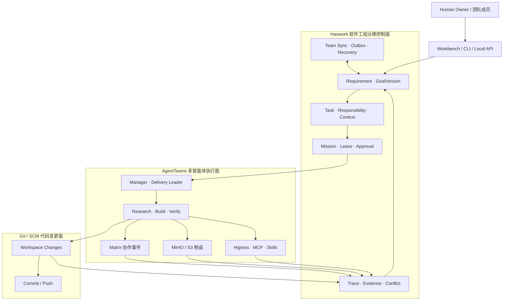

# Haowork

**AI 原生软件工程治理与追溯平台**

Haowork 面向“人提出需求与设计、Agent 执行开发”的新型软件工程模式。它把人的需求、
设计约束和责任分工转化为可版本化的工程事实，再将 AgentTeams 的多智能体执行过程、验证证据
和代码变化关联起来，形成一个位于 Agent 执行层之外的**软件工程治理控制面**。

传统 Git 主要回答“谁提交了什么代码”；Haowork 进一步尝试回答：

- 这次修改源于哪一条需求和哪一版设计？
- 哪个成员、哪个 Agent、基于什么上下文承担了责任？
- 实现是否偏离既定目标，结果由谁验证，证据在哪里？
- 项目换设备、换环境、换模型或换 Agent 后，如何保持工程连续性？
- 历史功能为什么这样设计，重构会影响哪些约束和责任边界？

> **项目状态：早期预览。** 本仓库已经实现治理事实、Mission、审批、执行追踪、团队同步、
> 签名迁移和 AgentTeams `v1.2.2` 适配合同。真实双区部署仍需要外部镜像、凭据、模型服务和
> Core Bridge 运行环境；缺失时脚本会返回明确的 `BLOCKED_*` 状态，不会用模拟结果冒充成功。

## 为什么需要 Haowork

AgentTeams 已经能够组织 Manager、Leader 和 Worker 协作，并通过 Matrix、MinIO 和 Higress
提供消息、制品与工具基础设施。Haowork 不重复这些能力，而是补充 AgentTeams 当前并不负责的
软件工程治理问题。

| 系统 | 主要回答的问题 | 在 Haowork 方案中的职责 |
| --- | --- | --- |
| AgentTeams | 多个 Agent 如何组织、沟通和执行？ | 多智能体执行面 |
| Haowork | 为什么执行、谁有权执行、是否偏离、证据是否可信、如何延续？ | 软件工程治理控制面 |
| Git / SCM | 哪些文件发生变化，形成了哪些提交？ | 代码版本与变更管理 |

Haowork 当前已经形成以下追溯链：

```text
Requirement -> GoalVersion -> Task -> Context -> Mission
            -> AgentTeams Run -> Trace / Evidence
            -> File Attribution / Workspace Digest
```

原生绑定 Git Commit/Push 是下一阶段能力，当前文档不会把它描述为已完成。

## 三个真实应用场景

### 1. 受限网络与敏感业务研发的跨环境连续开发

银行、证券、国防科研和其他敏感业务团队常同时面对两类环境：公网区拥有更强的模型、工具和
开源生态，内场或受限网络区拥有真实业务数据，并承担长期二次开发与运维。两个区域不能依赖持续
联网，也不能直接复制运行时身份、凭据、私人对话或完整工作目录。

Haowork 将需求版本、架构约束、任务责任、验证结论和允许导出的工程事实组成签名 Capsule。
导入方先验签、预览、审批和冲突检测，再把逻辑责任重新绑定到本地运行时。内场遇到难题时，也
可以只导出经过白名单和审批的最小问题上下文，在外场分析后将已批准增量重新导入。

**用户得到的价值：** 换环境、换模型和换 Agent 后仍能沿用前期需求与设计，不依赖复制整个项目
历史，也不会把跨区传输误解为两个区域必须联网。Haowork 提供治理机制，但不宣称替代组织自身的
安全、保密或合规认证。

### 2. AI Coding 小团队的需求、责任与偏差治理

在 3 到 10 人的小团队中，Agent 生成代码的速度可能远高于人的逐文件审查速度。随着成员持续
追加需求，人的记忆会衰减，Agent 也可能迎合最近一次指令，逐渐偏离最初设计。传统 Issue、聊天
和 Git Commit 分散保存信息，很难在一个视图中判断“需求是否变了”和“谁应为这项变化负责”。

Haowork 把 Requirement、GoalVersion、Task、Context、Mission、Approval 和 Evidence 组织为
追加式工程事实。人主要审核需求摘要、目标版本变化、关键设计、风险审批和独立验证结论；
Research、Build、Verify 等 Agent 则在明确的 Lease 和 Scope 内执行。

**用户得到的价值：** 团队不必逐行阅读所有 Agent 产物，也能持续检查方向、责任和验证状态。
当 Goal、设计或执行证据发生分歧时，系统显式产生冲突，而不是用最后一次写入静默覆盖历史。

### 3. 历史项目与开源项目二次开发的设计根因追溯

接手历史项目时，原成员可能已经离职；基于开源项目二次开发时，维护者也常只能看到代码和提交
说明，却不知道某个限制源于业务要求、架构取舍、环境条件还是一次临时修复。这会放大重构成本和
影响范围判断的不确定性。

对于从一开始使用 Haowork 的项目，可以从代码变化回查需求版本、上下文、责任人、Agent 任务
和验证证据。对于没有 Haowork 历史的旧项目，系统只做代码与文档导入、候选关系分析和人工确认，
建立一个可追溯基线；不会声称能够自动恢复原作者的真实意图。

**用户得到的价值：** 维护者能区分“已记录的工程事实”和“基于旧资料的推断”，更可靠地评估
重构原因、约束、责任和影响范围。

## 三层架构



主数据流：

1. 人创建或修改 Requirement 与 GoalVersion，并分配 Task 和责任边界。
2. Haowork 固化 Context，签发带完成条件、Lease、Scope 和审批约束的 Mission。
3. AgentTeams 根据 Mission 建立多角色拓扑并执行研究、实现和独立验证。
4. Matrix 事件、S3 制品、Skill 调用和工作区摘要进入 Trace Ledger。
5. Evidence 回到治理控制面；只有满足授权与完成条件的结果才能成为可信工程事实。
6. 多人节点通过 Team Sync 对账；目标、设计、租约或证据分歧必须显式处置。

## 当前已实现

- Requirement、GoalVersion、Task、Context、Lease、Mission 与风险分级审批。
- Logical Agent、Agent Function、运行时主体和 AgentTeams 实例的正交身份绑定。
- AgentTeams `v1.2.2` 官方 CRD、Matrix v3、MinIO/S3、Higress 与 MCP 适配合同。
- 独立 Trace Ledger、Evidence、Workspace Digest 和执行恢复游标。
- Team Sync、离线 Outbox、幂等对账和显式领域冲突处置。
- 签名 Capsule 的白名单导出、内存预览、审批导入和目标环境重新绑定。
- CLI、Local API 与 Workbench 的治理视图和操作入口。

## 下一阶段

- 将 Requirement / Mission / Evidence 与 Git Commit、Push 和 Pull Request 原生绑定。
- 完善需求版本、架构约束、责任矩阵和偏差审查的 Workbench 体验。
- 增强 GoalVersion 漂移分析和面向重构的影响范围查询。
- 完成旧项目基线导入、候选关系分析和人工确认流程。
- 在完整官方镜像、凭据和模型环境中取得真实双区 E2E 与可复验基准证据。

## 快速开始

环境要求：Go `1.26.5`、Node.js `24.14.0` 和 npm。AgentTeams 集群验证还需要 Docker
Desktop、Kind、Helm 与 kubectl。

```powershell
npm ci --prefix web
npm test --prefix web
npm run build --prefix web

go vet ./...
go test ./... -count=1
go build -trimpath -o bin/haowork.exe ./cmd/haowork
```

初始化项目：

```powershell
.\bin\haowork.exe init `
  --project .\example-project `
  --name example `
  --actor USR-OWNER `
  --goal "交付可审计的软件变更" `
  --done-when "验证通过并完成审批" `
  --json

.\bin\haowork.exe status --project .\example-project --json
.\bin\haowork.exe serve .\example-project
```

双区部署配置模板位于
[`deploy/agentteams/v1.2.2/.env.example`](deploy/agentteams/v1.2.2/.env.example)。
本地 `.env.local` 已被 Git 忽略，不得提交 API Key、Token、私钥、Kubeconfig 或云凭据。

## 验证边界

| 验证类型 | 当前能够证明什么 |
| --- | --- |
| Go、Web 与领域 E2E | 本地治理、同步、恢复、冲突、API 和 Workbench 合同 |
| AgentTeams 适配器测试 | 官方 CRD、Matrix、S3、Higress、MCP 的结构和失败关闭行为 |
| Kind / Helm 合同测试 | 部署脚本、镜像锁、网络策略和清理安全边界 |
| 真实双区 E2E | 只有使用真实镜像、模型、Core Bridge、Matrix、MinIO/S3 和 Higress 才能成立 |

本地测试通过不等于真实双区部署已经完成。详细状态请参阅
[AgentTeams 集成边界](docs/agentteams.md)。

## 文档

- [产品设计与工程治理模型](docs/product-design.md)
- [AgentTeams 集成边界](docs/agentteams.md)
- [CLI 使用说明](docs/cli.md)
- [Workbench 使用说明](docs/workbench.md)
- [AgentTeams v1.2.2 部署说明](deploy/agentteams/v1.2.2/README.md)
- [安全策略](SECURITY.md)
- [贡献指南](CONTRIBUTING.md)

## 许可证

Haowork 采用 [Apache License 2.0](LICENSE) 开源。
