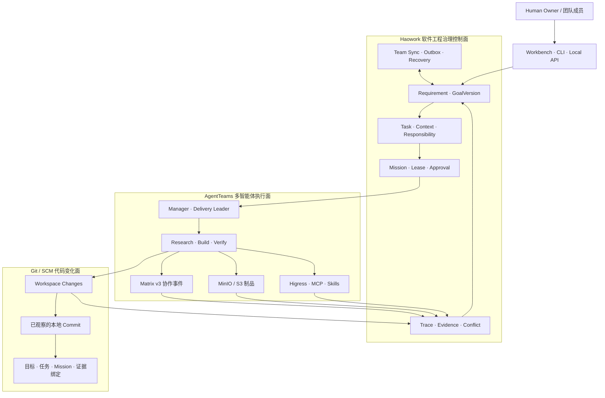
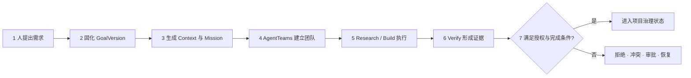

[English version](README.md) | 中文版

<h1 align="center">Haowork</h1>

<p align="center">
  <strong>AI 原生软件工程治理与追溯平台</strong><br>
  让 AgentTeams 负责协作执行，让工程目标、责任、证据与代码变化持续可追溯
</p>

<p align="center">
  
  
  
  
</p>

<p align="center">
  <a href="#-haowork-解决什么问题">问题</a> ·
  <a href="#-典型场景">场景</a> ·
  <a href="#️-总体架构">架构</a> ·
  <a href="#-haowork-与-agentteams-如何分工">分工</a> ·
  <a href="#-在线只读演示">在线演示</a> ·
  <a href="#-快速开始">开始使用</a> ·
  <a href="#-验证边界">验证边界</a>
</p>

> **项目状态：早期预览。** 仓库已经实现治理事实、Mission、风险审批、执行追踪、团队同步、
> 签名迁移、受治理的本地 Git Commit 追溯和 AgentTeams `v1.2.2` 适配合同。2026-08-16
> 已验证官方镜像清单和 Kind 本机双命名空间闭环，覆盖 Core Bridge、Matrix、S3、Higress MCP、
> 网络隔离与重启恢复。2026-09-04 已完成 Windows/Ubuntu 直接物理介质往返，四阶段交接、双向业务
> 网络隔离、Core 健康、L3 审批和运行身份重绑定均通过；原始制品、主机信息与凭据不进入公开仓库。
> A/B/C/D 基准仍未验证；依赖缺失时继续返回明确的 `BLOCKED_*`，不会用模拟结果冒充成功。

## 🎬 在线只读演示

> [!NOTE]
> 可访问 [haowork.112318.xyz](https://haowork.112318.xyz/) 浏览一个**预置公开案例**。
> 它展示需求链、AgentTeams 拓扑、审批、Trace 与跨环境迁移的关系；不连接真实项目、不接收凭据，
> 且服务端只提供读取路由，任何写请求都会被拒绝。

| 想看什么 | 在 Demo 中如何查看 |
| --- | --- |
| AI Coding 是否偏离初始设计 | 从 GoalVersion、需求状态和责任人回看交付边界 |
| 多 Agent 如何分工 | 查看 Manager、Leader、Research、Build、Verify 的受绑定拓扑 |
| 输出为什么可信 | 查看审批记录、Trace 时间线与独立验证摘要 |
| 跨区迁移怎样控制风险 | 查看 Capsule 的白名单、验签、审批和重新绑定步骤 |

在线演示由独立站点维护。本仓库不包含门户实现、服务器部署配置或运行环境凭据。

## 🧭 Haowork 解决什么问题

AI Coding 正把软件开发从“人写代码、工具辅助”推向“人提出目标与约束、Agent 执行交付”。
开发速度提高后，新的工程问题随之出现：

- 最近一次对话会不会覆盖最初的需求与架构约束？
- 多人同时指挥多个 Agent 时，谁提出、谁批准、谁实现、谁验证？
- 项目换设备、换模型、换 Agent 或迁移到隔离环境后，工程上下文如何延续？
- 接手历史系统时，如何从代码变化回查设计原因，而不是只看到最终文件？

传统 Git 主要记录“用户 - Commit/Push - 代码变化”。Haowork 在此基础上补充治理链：

```text
用户 -> 明确需求与设计 -> 责任与审批 -> Agent 执行证据 -> 代码变化
```

它不替代 Git，也不重新实现多智能体框架；它位于 Agent 执行层之外，负责把需求、设计、权限、
责任、证据和异常处置固化为可回放的工程事实。

| 使用者关心的问题 | Haowork 给出的工程回答 |
| --- | --- |
| 为什么要改？ | Requirement、GoalVersion 与 Context |
| 谁可以改？ | 四维身份、Lease、Scope 与 Approval |
| 谁实际执行？ | Mission、AgentTeams 拓扑与 RuntimeBinding |
| 结果是否可信？ | Trace、Evidence、Workspace Digest 与独立 Verify |
| 发生分歧怎么办？ | 追加式历史、显式 Conflict、人工决策与 Recovery |

## 🏭 典型场景

### 1. 敏感业务的公网区与内场连续开发

银行、证券、国防科研等团队经常同时面对两类环境：公网区拥有更强的模型、工具与开源生态；
内场保存真实业务数据，并承担长期二次开发和运维。两个区域不能依赖持续联网，也不能直接复制
运行时身份、凭据、私人对话或完整工作目录。

Haowork 把允许迁移的需求版本、架构约束、责任、验证结论和最小工程事实组成签名 Capsule。
导入方先验签、预览、审批和冲突检测，再把逻辑责任重新绑定到本地运行时。内场遇到难题时，
也可只导出经过白名单与审批的问题上下文，在外场分析后将已批准增量重新导入。

**实际帮助：** 换环境、换模型和换 Agent 后仍能延续前期设计；跨区迁移不要求两个区域联网，
也不把完整项目和敏感上下文直接带出。

### 2. AI Coding 小团队的责任与偏差治理

在 3 到 10 人的小团队里，Agent 产出代码的速度可能远高于人的逐文件审查速度。成员不断追加需求，
人的记忆会衰减，Agent 也可能迎合最近指令而偏离最初设计。Issue、聊天和 Commit 分散保存信息，
很难在同一视图里判断“目标是否变化”和“谁应为变化负责”。

Haowork 维护追加式 Requirement、GoalVersion、Task、Context、Mission、Approval 与 Evidence。
人主要审核目标变化、关键设计、风险审批和独立验证；Research、Build、Verify Agent 只在明确的
Lease 与 Scope 内工作。

**实际帮助：** 团队不必逐行阅读所有 Agent 产物，也能检查方向、责任和验证状态；出现目标、
设计或证据分歧时，系统显式产生冲突，而不是静默覆盖历史。

### 3. 历史项目与开源项目的设计根因追溯

接手历史系统时，原成员可能已经离职；基于开源项目二次开发时，维护者通常只能看到代码与提交，
却不知道某个限制源于业务要求、架构取舍、环境条件还是临时修复。

从一开始使用 Haowork 的项目，可由代码变化回查需求版本、上下文、责任、Agent 任务与验证证据。
没有 Haowork 历史的旧项目，只建立“代码与文档导入 -> 候选关系 -> 人工确认”的可追溯基线，
不会声称自动恢复原作者的真实意图。

**实际帮助：** 维护者可以区分已记录事实与后续推断，更可靠地评估重构原因、约束和影响范围。

## 🧩 产品形态

Haowork 当前提供三类入口，共享同一份治理投影：

| 入口 | 主要用途 |
| --- | --- |
| Workbench | 查看目标、Mission、拓扑、审批、Trace、冲突和迁移预览 |
| CLI | 初始化项目、签发 Mission、同步团队状态和执行治理操作 |
| Local API / MCP | 为浏览器与 Agent Runtime 提供受认证、受策略约束的能力 |

输入是人的目标、设计约束和审批决定；输出不是一段聊天摘要，而是可验证、可回放、可迁移的工程事实。

## 🏗️ 总体架构



SCM 原生能力可以把显式选择的本地 Git Commit 绑定到目标、任务、Mission 和已投影证据。GitHub `github.com`
的 ref、Pull Request、Review、Check Run 与 Commit Status 也可以通过 GET-only 观察器读取。GitHub 写操作、
Webhook、GitLab 与其他托管平台集成仍属于后续能力。

## 🔗 受治理的 Git Commit 追溯

Haowork 不替用户创建或推送 Commit。开发者或交付工具仍按正常 Git 流程提交，再显式要求 Haowork
观察该不可变对象并提出治理绑定：

```text
本地 Git 仓库 -> 完整 Commit OID -> 只读对象检查
  -> 提议目标 / 任务 / Mission / 证据关系
  -> 按风险人工审批 -> 确认绑定
  -> 可达性复核 -> 历史分歧时标记 superseded / invalidated
```

- 事件账本只保存对象 ID、作者/提交者显示名、邮箱摘要、提交消息和变化路径。
- 不保存原始邮箱、remote URL、源码、patch、凭据或私有仓库绝对路径。
- L2/L3 确认必须存在载荷哈希完全匹配的审批；Build 不能自批高风险关系。
- 绑定确认不会自动完成 Task，现有 Evidence 与完成门禁仍是权威边界。
- force-move 等导致 Commit 不再可达时，原事实仍保留，绑定会显式失效。

可运行 `haowork scm --help`，或使用 Workbench 的 **Git / SCM** 面板。精确策略与边界见
[`docs/scm-provenance.md`](docs/scm-provenance.md)。

GitHub 观察使用运行中的 Local Core 执行 `haowork scm github connect`、`sync` 与 `status`。仓库身份只从本地
`origin` 推导；不保存 Token 或 PR 正文；PR 合并和 Check 成功都不会自动完成 Task。具体配置见
[`docs/scm-github-observer.md`](docs/scm-github-observer.md)。

## 🔄 一条需求如何流转



每一步都有输入、责任主体与失败出口。Agent 的输出不能自行变成“完成”；候选结果必须同时满足
授权、制品摘要、独立验证和必要审批。

## 🪪 多人团队的四维身份模型

Haowork 不用一个模糊的 `role` 同时表达用户权限、Agent 职能和运行时身份，而是拆成四个正交维度：

| 维度 | 示例 | 回答的问题 |
| --- | --- | --- |
| SubjectKind | Human / Agent | 行为主体是什么 |
| GovernanceRole | Owner / Lead / Reviewer / Agent | 谁能决策与审批 |
| AgentFunction | Manager / Leader / Research / Build / Verify | Agent 承担什么交付职能 |
| RuntimeBinding | Environment / Instance / Principal / Room / Revision | 当前由哪个运行载体执行 |

RuntimeBinding 变化会生成新 Revision，旧绑定仍保留；Build 与 Verify 必须由不同逻辑 Agent 承担；
高风险请求不能由请求人自批。

## 🤝 Haowork 与 AgentTeams 如何分工

| 层面 | Haowork | AgentTeams v1.2.2 |
| --- | --- | --- |
| 决策与授权 | GoalVersion、Mission、Lease、Scope、Approval | 消费已经授权的 Mission |
| 团队组织 | 规定角色、责任和运行时绑定 | 创建 Manager、Worker、Team、Human CRD |
| 协作执行 | 校验边界并接收结果 | Manager 拆解 WorkItem，角色 Agent 协同执行 |
| 消息与制品 | 校验 Mission、环境、摘要和归属 | Matrix 传递事件，MinIO/S3 保存制品 |
| 工具调用 | Policy Runtime、MCP 认证、Skill 审计 | Higress 提供 Consumer 与 Route 基础设施 |
| 完成判定 | Verify、Evidence、审批和冲突处置 | 不自行修改 Goal 或判定治理完成 |

### AgentTeams 角色如何落地

| 角色 | 在 Haowork 数据流中的职责 |
| --- | --- |
| Manager | 接收 Mission、管理团队拓扑、委派 WorkItem |
| Delivery Leader | 协调交付节奏和角色间依赖，不拥有最终审批权 |
| Research | 收集约束、方案与外部证据，不直接改写治理事实 |
| Build | 在授权 Scope 内实现并产生工作区摘要与制品 |
| Verify | 独立验证 Build 结果，形成可审计 Evidence |
| Human Owner | 决定目标、拓扑、高风险审批和冲突处置 |

官方模块对应关系：CRD 管理团队拓扑；Matrix v3 传递委派与状态事件；MinIO/S3 保存受摘要约束的
制品；Higress 检查 Consumer、Route 与 MCP 绑定；MCP 将 Haowork Skills 暴露给受认证 Runtime。

## 🛠️ Skill 工程体系

Haowork Skills 不是提示词清单，而是带版本、输入 Schema、权限、风险级别、审计记录和失败码的
治理工具。目前注册 11 个 canonical Skills，覆盖：

- **Core Skills：** `plan`、`context`、`history`、`record`、`verify`、`export`、`import`
- **Cross-zone Skills：** `advisory`、`mirror`、`patch`、`audit`

一次 Skill 调用必须经过 RuntimeBinding、Mission、Lease、Scope、风险策略和输入 Schema 校验；
Trace Ledger 或 Audit 不可用时失败关闭。

## ✅ 当前已实现

- Requirement、GoalVersion、Task、Context、Lease、Mission 与风险分级审批。
- Logical Agent、Agent Function、运行时主体和 AgentTeams 实例的正交身份绑定。
- AgentTeams `v1.2.2` 官方 CRD、Matrix v3、MinIO/S3、Higress 与 MCP 适配合同。
- 独立 Trace Ledger、Evidence、Workspace Digest 与执行恢复游标。
- Team Sync、离线 Outbox、幂等对账和显式领域冲突处置。
- 签名 Capsule 的白名单导出、内存预览、审批导入和目标环境重新绑定。
- CLI、Local API 与 Workbench 的治理视图和操作入口。

## 🚀 快速开始

基础环境：Go `1.26.5`、Node.js `24.14.0` 和 npm。AgentTeams 集群验证还需要 Docker Desktop、
Kind、Helm 与 kubectl。

```powershell
npm ci --prefix web
npm test --prefix web
npm run build --prefix web

go vet ./...
go test ./... -count=1
go build -trimpath -o bin/haowork.exe ./cmd/haowork
```

初始化并查看一个项目：

```powershell
.\bin\haowork.exe init `
  --project .\example-project `
  --name example `
  --actor USR-OWNER `
  --goal "交付可审计的软件变更" `
  --done-when "验证通过并完成审批" `
  --json

.\bin\haowork.exe status --project .\example-project --json
.\bin\haowork.exe serve .\example-project
```

双区部署配置模板位于
[`deploy/agentteams/v1.2.2/.env.example`](deploy/agentteams/v1.2.2/.env.example)。
本地 `.env.local` 已被 Git 忽略，不得提交 API Key、Token、私钥、Kubeconfig 或云凭据。

只读演示站 [haowork.112318.xyz](https://haowork.112318.xyz/) 已上线。它用于浏览预置项目、拓扑、
需求链、审批、Trace 与迁移流程；服务端不提供写操作，也不替代真实双区 E2E 证据。

## 🧪 验证边界

| 验证类型 | 当前能够证明什么 |
| --- | --- |
| Go、Web 与领域 E2E | 本地治理、同步、恢复、冲突、API 与 Workbench 合同 |
| AgentTeams 适配器测试 | 官方 CRD、Matrix、S3、Higress、MCP 的结构与失败关闭行为 |
| Kind / Helm 合同测试 | 部署脚本、镜像锁、网络策略和清理安全边界 |
| 真实双区 E2E | 只有使用真实镜像、模型、Core Bridge、Matrix、MinIO/S3 与 Higress 才能成立 |

本地测试通过不等于真实双区部署已经完成。真实依赖缺失时，验收脚本必须返回 `BLOCKED_*`。
详细状态参阅 [AgentTeams 集成边界](docs/agentteams.md)。

## 🗺️ 下一阶段

- 在不增加托管平台写控制的前提下，将只读 SCM 观察扩展到 GitHub `github.com` 之外。
- 完善需求版本、架构约束、责任矩阵与偏差审查的 Workbench 体验。
- 增强 GoalVersion 漂移分析和面向重构的影响范围查询。
- 完成旧项目基线导入、候选关系分析和人工确认流程。
- 在完整官方镜像、凭据与模型环境中取得真实双区 E2E 和可复验基准证据。

## 📚 文档

- [产品设计与工程治理模型](docs/product-design.md)
- [GitHub 远端 SCM 只读观察](docs/scm-github-observer.md)
- [AgentTeams 集成边界](docs/agentteams.md)
- [CLI 使用说明](docs/cli.md)
- [Workbench 使用说明](docs/workbench.md)
- [AgentTeams v1.2.2 部署说明](deploy/agentteams/v1.2.2/README.md)
- [安全策略](SECURITY.md)
- [贡献指南](CONTRIBUTING.md)

## 📄 许可证

Haowork 采用 [Apache License 2.0](LICENSE) 开源。
