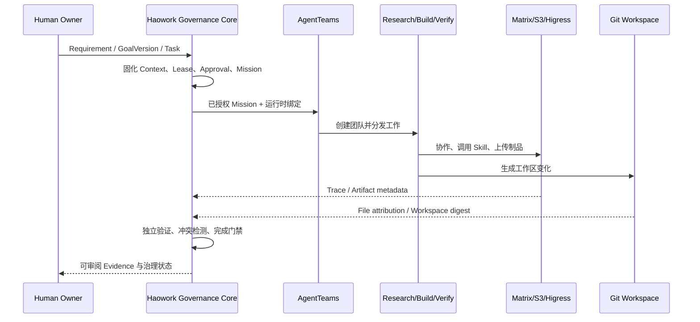

# AgentTeams 集成边界

Haowork 使用 AgentTeams 作为多智能体执行面，并在其外部提供软件工程治理控制面。两者是上下游
关系，不是替代关系。

## AgentTeams 已经负责什么

AgentTeams `v1.2.2` 已提供：

- Manager、Team、Worker、Human 等运行时资源与团队编排；
- Matrix 中的多角色协作、状态传递和人工参与；
- MinIO/S3 制品共享；
- Higress 网关、凭据隔离和工具访问；
- Skills、MCP 与 Agent 执行循环。

因此，Haowork 不把“能创建多个 Agent”或“Agent 之间能聊天”作为自身核心创新。

## Haowork 补充什么

Haowork 在执行面之前和之后增加以下治理合同：

| 阶段 | Haowork 负责的治理事实 |
| --- | --- |
| 执行前 | Requirement、GoalVersion、Task、责任归属、Context、Lease、Mission、Approval |
| 执行中 | Logical Agent 与运行时主体绑定、Skill Scope、策略决定、恢复游标、Workspace Digest |
| 执行后 | Trace、Evidence、完成条件、冲突、Team Sync、签名 Capsule 与重新绑定 |

控制器而不是模型决定允许的动作、可接受的证据、状态转换、审批边界和恢复位置。Agent 即使声称
“完成”，也必须通过外部治理状态与独立验证才能更新项目事实。

## 官方适配基线

- AgentTeams tag：`v1.2.2`
- Kubernetes API：`agentteams.io/v1beta1`
- CRD：`Manager`、`Worker`、`Team`、`Human`
- 数据面：Matrix v3、MinIO/S3、Higress 和 Haowork MCP

生产桥接在任何远端写入前校验环境、Mission、运行时身份、Higress Consumer/Route 和 MCP
绑定。Matrix cursor 保持为不透明恢复令牌；制品必须绑定环境、Mission、大小和 SHA-256。

## 角色如何落地

| AgentTeams 角色 | 执行职责 | Haowork 绑定 |
| --- | --- | --- |
| Manager | 接收任务并建立团队 | Mission、Project、Environment、Runtime Binding |
| Delivery Leader | 拆解工作和协调依赖 | GoalVersion、Task、Context |
| Research | 收集事实、约束和备选方案 | 只读 Scope、Evidence 要求 |
| Build | 修改代码并产生制品 | 写 Lease、允许路径、Skill Scope |
| Verify | 独立运行验证 | 独立身份、验证条件、Artifact SHA |
| Human Owner | 决定高风险目标和审批 | Project Role、Approval、Conflict Resolution |

同一个逻辑角色不能仅凭名称冒充。Haowork 同时校验逻辑身份、运行时主体、AgentTeams 实例、
环境、房间和修订号。

## 端到端数据流

当前代码已经将治理事实追踪到文件归属和工作区摘要。Git Commit、Push 和 Pull Request 的原生
关联属于下一阶段，不能用文件摘要测试替代。

## 双区边界

公网区和受限网络区是两个独立运行环境，不要求互相联网。每个区域分别拥有：

- Haowork 事件历史；
- AgentTeams 运行时身份；
- 模型和服务凭据；
- Matrix、MinIO/S3、Higress 与 MCP 实例。

区域之间只通过白名单、签名、可预览和需审批的 Capsule 转移工程事实与制品引用。运行时主体、
密钥、私人聊天和未经批准的工作区内容不会随 Capsule 迁移。

## 当前部署状态

部署清单位于 `deploy/agentteams/v1.2.2/`，脚本使用
`scripts/p0-05-v122-*.ps1`。生产部署要求所有镜像锁定到已审核摘要，并从运行时 Secret 读取
凭据。

当前本地和合同测试可以验证适配器与失败关闭行为。真实双区数据路径还依赖受认证的远端
`haowork-core-bridge`、完整镜像清单、模型凭据、Matrix、MinIO/S3 和 Higress。在这些条件未满足
时，验收必须保持 `BLOCKED_*`，不得生成成功证据。
